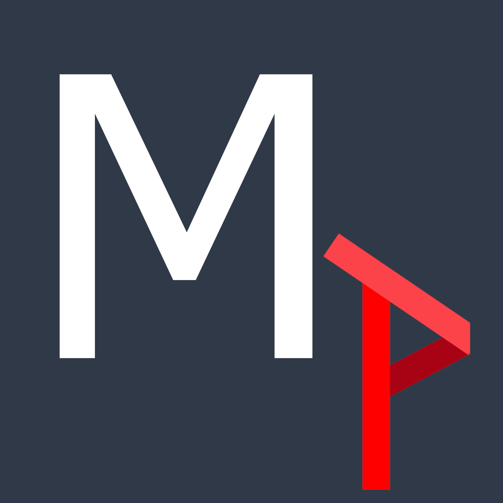

<h1>  MozPort </h1>

<h4> Welcome to my project for continuing to learn, practice, and demonstrate my web development skills! </h4>

It is an MVC application based on Rails 6 that implements a variety of packages.

I have a number of ideas that I want to implement in this project, and I hope it will keep growing.

# Software packages
- Rails (6.0.3.2)
- Ruby (2.6.5)
- Devise (4.7.2)
- Active Storage Validations (0.9.0)
- Action Cable (6.0.3.4)
- Redis (4.2.2)
- Bootstrap CSS (4.0.0)

Testing modules:
- RSpec-Rails (4.0.1)
- CapyBara (3.33.0)
- FactoryBot (6.1.0)
- DatabaseCleaner (1.8.5)

Storage and deployment:
- PostgreSQL (1.2.3)
- AWS SDK S3 (1.83.0)
- Heroku (7.46.0)
